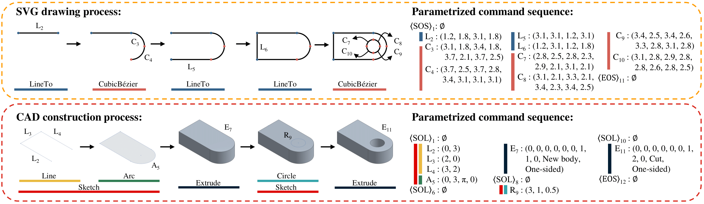

# Drawing2CAD

This repository provides implementation code for our paper:

**Drawing2CAD: Sequence-to-Sequence Learning for CAD Generation from Vector Drawings**

[Feiwei Qin](https://scholar.google.com/citations?user=2Y06Jo4AAAAJ&hl=zh-CN), Shichao Lu, [Junhao Hou](https://scholar.google.com/citations?user=IZbQymsAAAAJ&hl=en), [Changmiao Wang](https://scholar.google.com/citations?user=47KhMXEAAAAJ&hl=zh-CN), [Meie Fang](https://scholar.google.com/citations?user=Se20XL0AAAAJ&hl=en), [Ligang Liu](https://scholar.google.com/citations?user=1U9U_cYAAAAJ&hl=zh-CN)

**ACM Multimedia 2025** (camera-ready version coming soon)



## Dependencies

- Python 3.9
- Cuda 11.8+

Install python package dependencies through pip:

```bash
pip install -r requirements.txt
```

## Dataset

Download data from [here](https://drive.google.com/drive/folders/1t9uO2iFh1eVDXRCKUEonKPBu8WGYA8wU?usp=sharing) and extract them under `data` folder.

- `svg_raw` contains the engineering drawings of each CAD model in SVG format, including four views: `Front`, `Top`, `Right`, and `FrontTopRight`. Each SVG file has been preprocessed through path simplification and deduplication, path reordering, and viewbox normalization. To obtain engineering drawings in PNG format, you can simply convert them using [CairoSVG](https://cairosvg.org/) with a single line of code:

  ```python
  import cairosvg
  
  cairosvg.svg2png(url=svg_path, write_to=png_path, output_width=224, output_height=224, background_color='white')
  ```

- `svg_vec` contains vectorized representations of SVG drawing sequences. Each file stores the stacked drawing sequences for the four views (`Front`, `Top`, `Right`, and `FrontTopRight`), saved in `.npy` format to enable fast data loading.

- `cad_vec` contains our vectorized representation for CAD sequences, saved in `.h5` format to enable fast data loading.

## Training

To train the model in different input options:

```bash
python train.py --input_option {1x, 3x, 4x} --exp_name your_exp_name
```

Since different input options lead to different models, it is recommended to specify the experiment name using `--exp_name` for each run. For more configurable parameters and options, please refer to `config/config.py`.

## Testing and Evaluation

After training the model, run the model to inference all test data:

```python
python test.py --input_option {1x, 3x, 4x} --exp_name your_exp_name
```

After inference, the final results will be saved under `proj/your_exp_name/test_results`. To evaluate the model inference results and to export and visualize the final CAD models, please refer to the code from [DeepCAD](https://github.com/ChrisWu1997/DeepCAD).

## Cite

coming soon.