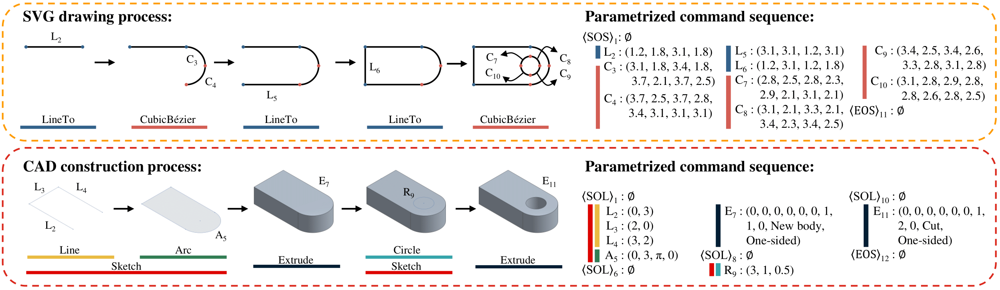

<div align="center">

# Drawing2CAD: Sequence-to-Sequence Learning for CAD Generation from Vector Drawings

<h4>
  <a href='https://scholar.google.com/citations?user=2Y06Jo4AAAAJ&hl=zh-CN' target='_blank'>Feiwei Qin</a><sup>1*</sup>
  ·
  <a href='' target='_blank'>Shichao Lu</a><sup>1*</sup>
  ·
  <a href='https://scholar.google.com/citations?user=IZbQymsAAAAJ&hl' target='_blank'>Junhao Hou</a><sup>2*</sup>
  ·
  <a href='https://scholar.google.com/citations?user=47KhMXEAAAAJ&hl' target='_blank'>Changmiao Wang</a><sup>3</sup>
  ·
  <a href='https://scholar.google.com/citations?user=Se20XL0AAAAJ&hl' target='_blank'>Meie Fang</a><sup>4†</sup>
  ·
  <a href='https://scholar.google.com/citations?user=1U9U_cYAAAAJ&hl' target='_blank'>Ligang Liu</a><sup>5†</sup>
</h4>

<h5>
  <sup>1</sup>Hangzhou Dianzi University  <sup>2</sup>Zhejiang University  <sup>3</sup>Shenzhen Research Institute of Big Data  <br><sup>4</sup>Guangzhou University  <sup>5</sup>University of Science and Technology of China
</h5>

<h4>
  ACM Multimedia 2025
</h4>

<h5>
  *These authors contributed equally to this work.
</h5>

[](https://arxiv.org/abs/2508.18733)
[]()
[](https://drive.google.com/drive/folders/1t9uO2iFh1eVDXRCKUEonKPBu8WGYA8wU?usp=sharing)



</div>

## 🐍 Installation

- Python 3.9
- Cuda 11.8+

Install python package dependencies through pip:

```bash
pip install -r requirements.txt
```

## 📥 Dataset

Download data from [here](https://drive.google.com/drive/folders/1t9uO2iFh1eVDXRCKUEonKPBu8WGYA8wU?usp=sharing) and extract them under `data` folder.

- `svg_raw` contains the engineering drawings of each CAD model in SVG format, including four views: `Front`, `Top`, `Right`, and `FrontTopRight`. Each SVG file has been preprocessed through path simplification and deduplication, path reordering, and viewbox normalization. To obtain engineering drawings in PNG format, you can simply convert them using [CairoSVG](https://cairosvg.org/) with a single line of code:

  ```python
  import cairosvg
  
  cairosvg.svg2png(url=svg_path, write_to=png_path, output_width=224, output_height=224, background_color='white')
  ```

- `svg_vec` contains vectorized representations of SVG drawing sequences. Each file stores the stacked drawing sequences for the four views (`Front`, `Top`, `Right`, and `FrontTopRight`), saved in `.npy` format to enable fast data loading.

- `cad_vec` contains our vectorized representation for CAD sequences, saved in `.h5` format to enable fast data loading.

## 🚀 Training

To train the model in different input options:

```bash
python train.py --input_option {1x, 3x, 4x} --exp_name your_exp_name
```

Since different input options lead to different models, it is recommended to specify the experiment name using `--exp_name` for each run. For more configurable parameters and options, please refer to `config/config.py`.

## 📍 Evaluation

After training the model, run the model to inference all test data:

```python
python test.py --input_option {1x, 3x, 4x} --exp_name your_exp_name
```

After inference, the final results will be saved under `proj/your_exp_name/test_results`. To evaluate the model inference results and to export and visualize the final CAD models, please refer to the code from [DeepCAD](https://github.com/ChrisWu1997/DeepCAD).

## 🌹 Acknowledgement

This repository builds upon the following awesome datasets and projects:

- [DeepCAD](https://github.com/ChrisWu1997/DeepCAD)
- [FreeCAD](https://github.com/FreeCAD/FreeCAD)
- [CairoSVG](https://cairosvg.org/)

## Cite

If you find this project useful for your research, please use the following BibTeX entry.

```
@article{qin2025drawing2cad,
  title={Drawing2CAD: Sequence-to-Sequence Learning for CAD Generation from Vectorized Drawings},
  author={Qin, Feiwei and Lu, Shichao and Hou, Junhao and Wang, Changmiao and Fang, Meie and Liu, Ligang},
  journal={arXiv preprint arXiv:2508.18733},
  year={2025}
}
```
